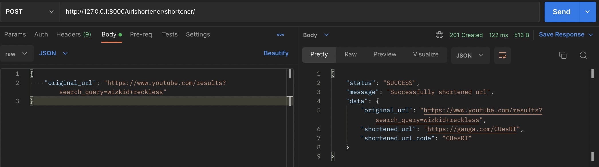
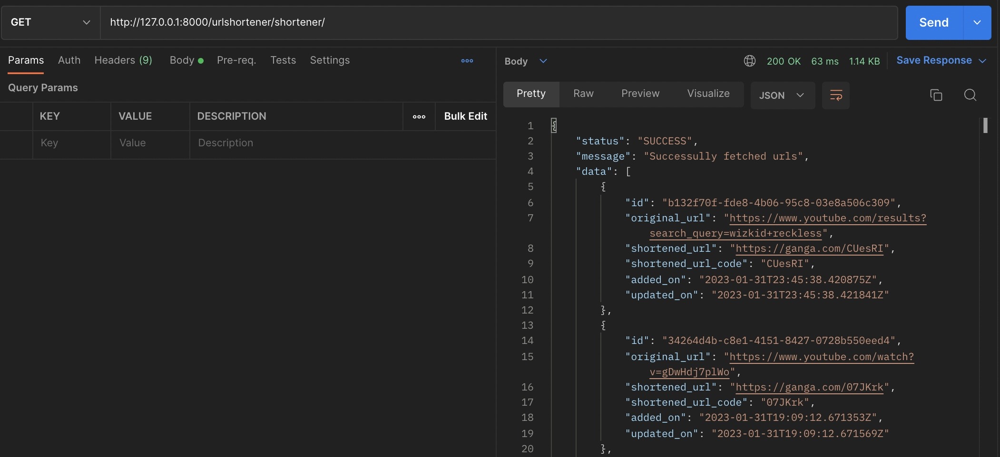
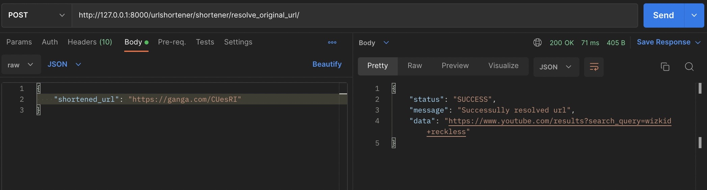

# django-url-shortener

url shortener api built with Django

## Requirement

1. Docker
2. Docker Compose

## Usage

```
1. clone the repository at the location: https://github.com/saviganga/django-url-shortener

2. navigate to the root directory (directory with docker-compose.yml file)

3. run docker-compose build to build docker image

4. run docker-compose up to start the container

5. navigate to 127.0.0.1:8000/urlshortener/shortener/
    - shorten_url: make a POST request with the original url to be shortened. endpoint applies url_shortener algorithm

    

    - view_all_urls: make a GET request to view all original and shortened urls

    

6. navigate to 127.0.0.1:8000/urlshortener/shortener/resolve_original_url/
    - resolve_url: make a POST request with the shortened url generataed by the app to get the original url

    
    
```

## License

[MIT](https://choosealicense.com/licenses/mit/)